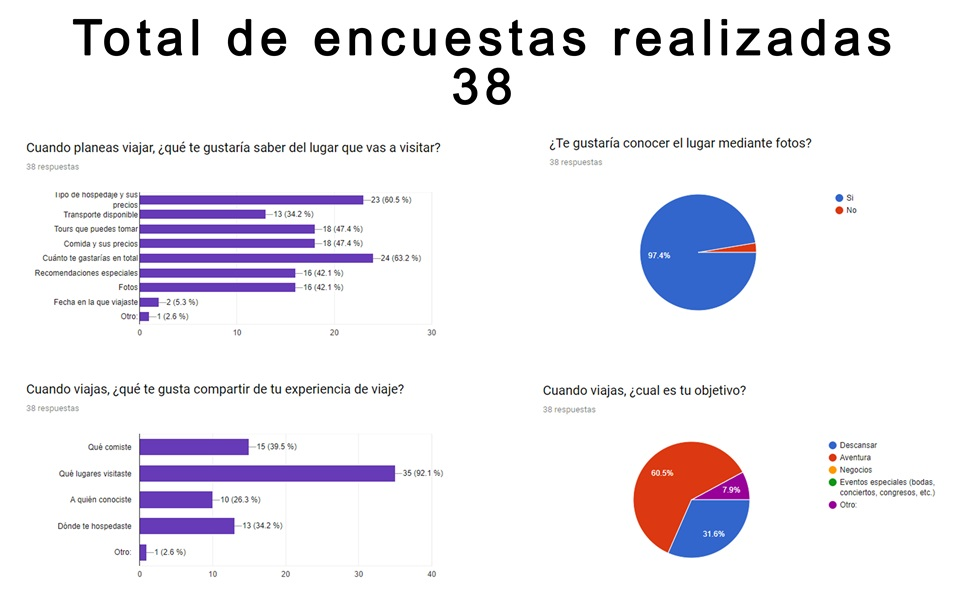
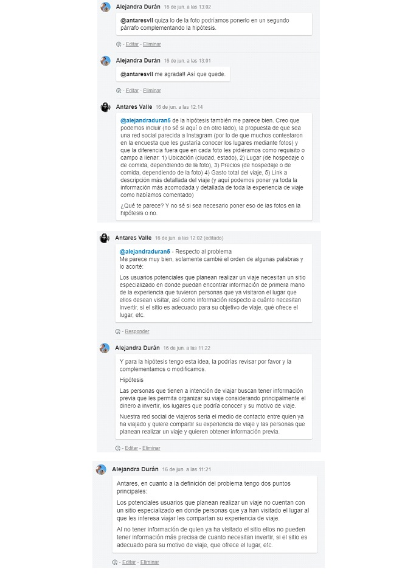
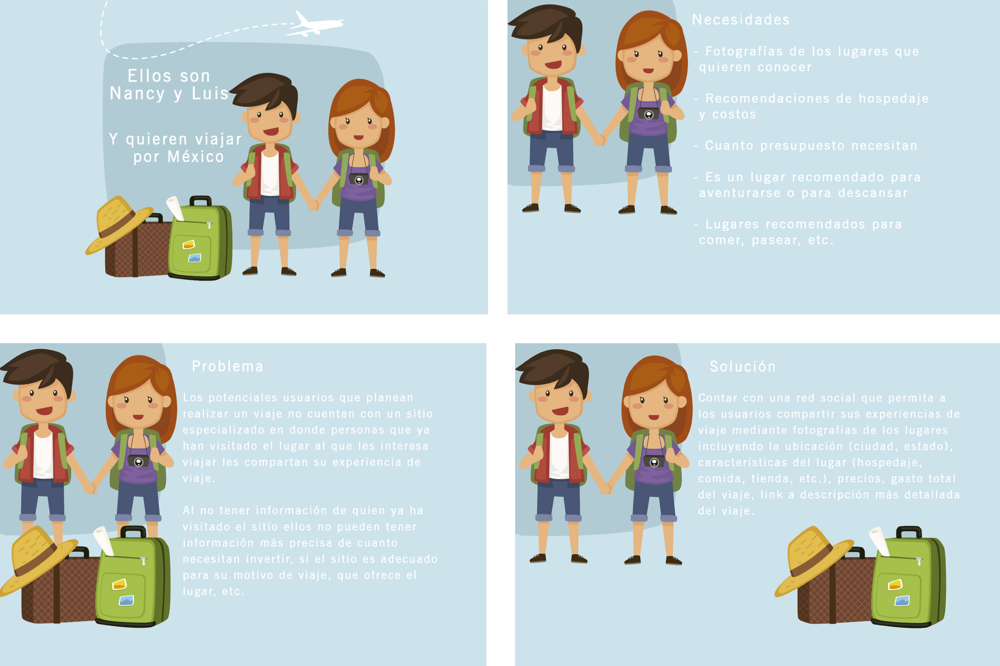

# Red Social
 
## Investigación

Se detecta una problemática para las personas que quieren realizar un viaje y no cuentan con un sitio para informarse sobre los lugares que quieren conocer. Mediante una investigación se identificó que existe interés de contar con información previa al viaje como fotografías,  recomendaciones de personas que ya han visitado el lugar, costos, etc. 

### Resultado de encuestas

Se realizaron encuestas y con base en los resultados encontramos que:
Los potenciales usuarios de la red social de viajeros muestran interés principalmente en conocer cuánto se invirtió en el viaje incluyendo el hospedaje (más del 60%). También busca conocer el lugar mediante fotografías de otros viajeros (más del 90%). Más del 60% viaja en plan de aventura mientras que más del 30% lo hace por descanso. 

Puntos principales a mostrar en la red social serian:

1.	Cuanto se invirtió en el viaje
2.	Tipo de hospedaje y precios
3.	Mostrar fotografías del lugar incluyendo un pequeño comentario del sitio
4.	Objetivo de haber viajado

Después de estos puntos se podrían considera en orden de importancia según las encuestas:

1.	Tours que puede tomar / Comida y precios
2.	Recomendaciones especiales / Fotos
3.	Transporte disponible
4.	Fecha de viaje
5.	A quien conociste

## Hipótesis

Los usuarios potenciales que planean realizar un viaje necesitan un sitio especializado en donde puedan encontrar información de primera mano de la experiencia que tuvieron personas que ya visitaron el lugar que ellos desean visitar, así como información respecto a cuánto necesitan invertir, si el sitio es adecuado para su objetivo de viaje, qué ofrece el lugar, etc.

#### Definición del problema 

Los usuarios potenciales que planean realizar un viaje necesitan un sitio especializado en donde puedan encontrar información de primera mano de la experiencia que tuvieron personas que ya visitaron el lugar que ellos desean visitar, así como información respecto a cuánto necesitan invertir, si el sitio es adecuado para su objetivo de viaje, qué ofrece el lugar, etc. 

#### Lluvia de ideas
 
 
 

## Propuesta de solución
Contar con una red social que permita a los usuarios compartir sus experiencias de viaje mediante fotografías de los lugares incluyendo la ubicación (ciudad, estado), características del lugar (hospedaje, comida, tienda, etc.), precios, gasto total del viaje, link a descripción más detallada del viaje. 

## Sketching

 

¿Cómo una red social de viajes resuelve las necesidades de los clientes? Para esto generamos un pequeño video:

 [Historia de usuario](https://www.powtoon.com/c/buruBi4eeGP/1/m)

Y realizamos el Mockup detallando el flujo de nuestra aplicación:

<iframe src="https://marvelapp.com/6i223a6?emb=1&iosapp=false&frameless=false" width="1440" height="1024" allowTransparency="true" frameborder="0"></iframe>
